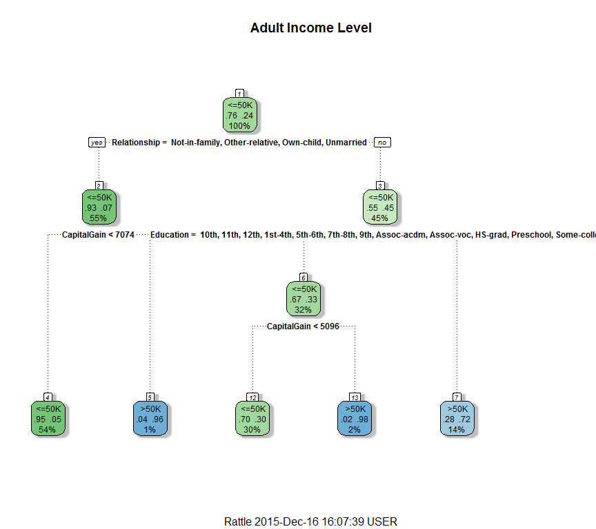

# Decision Trees


## Loading and preprocessing the data
First, load up necessary packages and then download the data and read it into memory. The rattle package may prompt you to install something else; click OK and then restart R for it to work!


```r
library(rpart)
suppressWarnings(library(rpart.plot))
suppressMessages(suppressWarnings(library(rattle)))
```
## Download adult income data from the UCI Machine Learning Repository


```r
url.train <- "http://archive.ics.uci.edu/ml/machine-learning-databases/adult/adult.data"
url.test <- "http://archive.ics.uci.edu/ml/machine-learning-databases/adult/adult.test"
url.names <- "http://archive.ics.uci.edu/ml/machine-learning-databases/adult/adult.names"
download.file(url.train, destfile = "adult_train.csv")
download.file(url.test, destfile = "adult_test.csv")
download.file(url.names, destfile = "adult_names.txt")
```


```r
train <- read.csv("adult_train.csv", header = FALSE)
```
The test data has an unnecessary first line that messes stuff up, this fixes that problem

```r
all_content <- readLines("adult_test.csv")
skip_first <- all_content[-1]
test <- read.csv(textConnection(skip_first), header = FALSE)
```

## Prepare the data for analysis
Column names were found in adult_names.txt downloaded above; inspection of the outcome variable (IncomeLevel) in the test set shows that there is a period in IncomeLevel in the test set but not in the training set. This adds the column names and sets the outcome variables to be the same.


```r
varNames <- c("Age", 
              "WorkClass",
              "fnlwgt",
              "Education",
              "EducationNum",
              "MaritalStatus",
              "Occupation",
              "Relationship",
              "Race",
              "Sex",
              "CapitalGain",
              "CapitalLoss",
              "HoursPerWeek",
              "NativeCountry",
              "IncomeLevel")

names(train) <- varNames
names(test) <- varNames
levels(test$IncomeLevel) <- levels(train$IncomeLevel)
file.remove("adult_test.csv")
```

```
## [1] TRUE
```

```r
file.remove("adult_train.csv")
```

```
## [1] TRUE
```

# Use rpart to grow our decision tree


```r
tree <- rpart(IncomeLevel ~ .,
              data = train,
              method = "class")
print(tree)
```

```
## n= 32561 
## 
## node), split, n, loss, yval, (yprob)
##       * denotes terminal node
## 
##  1) root 32561 7841  <=50K (0.75919044 0.24080956)  
##    2) Relationship= Not-in-family, Other-relative, Own-child, Unmarried 17800 1178  <=50K (0.93382022 0.06617978)  
##      4) CapitalGain< 7073.5 17482  872  <=50K (0.95012012 0.04987988) *
##      5) CapitalGain>=7073.5 318   12  >50K (0.03773585 0.96226415) *
##    3) Relationship= Husband, Wife 14761 6663  <=50K (0.54860782 0.45139218)  
##      6) Education= 10th, 11th, 12th, 1st-4th, 5th-6th, 7th-8th, 9th, Assoc-acdm, Assoc-voc, HS-grad, Preschool, Some-college 10329 3456  <=50K (0.66540807 0.33459193)  
##       12) CapitalGain< 5095.5 9807 2944  <=50K (0.69980626 0.30019374) *
##       13) CapitalGain>=5095.5 522   10  >50K (0.01915709 0.98084291) *
##      7) Education= Bachelors, Doctorate, Masters, Prof-school 4432 1225  >50K (0.27639892 0.72360108) *
```

Everything we need to know is in that text, but it's kind of hard to read. Let's make a picture so we can visualize our model.

```r
fancyRpartPlot(tree, main = "Adult Income Level")
```

 

Let's try to interpret this. If someone's "Relationship" variable is Not-in-family, Other-relative, Own-child, or Unmarried (and the other options are Husband or Wife), we send them to the left and if it's anything else, we send them to the right at the first branch. 

It turns out that 55% of people are classified as one of those relationship statuses and 54% out of the 55% that also have CapitalGain under $7074 are classified as low income in our data set. Thus, these simple rules on two variables correctly classify 98% of the people with one of those relationship statuses!

Also notice how this tree only utilized 3 of the 14 available predictor variables! If you have high dimensional data, using too many variables will cause you to overfit to your training data so rpart automatically uses a feature selection methodology to select a small number of predictors to build the tree.

## How well does our simple decision tree predict given a new set of data data (i.e. the test set)?

This chunk of code decides if our tree assigns probability of at least .5 to outcome " <=50K"; if so, we will say out tree predicts " <=50K" (i.e. this person has under $50,000 in income) and if not we say it predicts " >50K" (i.e. this person has more than $50,000 in income).

```r
outcomes <- predict(tree, test[1:14])
predictions <- ifelse(outcomes[,1] >= .5, " <=50K", " >50K") # 

accuracy <- round(sum(predictions == test[,15])/length(predictions), digits = 4)
print(paste("The model correctly predicted the test outcome ", accuracy*100, "% of the time", sep=""))
```

```
## [1] "The model correctly predicted the test outcome 84.45% of the time"
```
So we were right with the test set 84.45% of the time! Not bad, but we can probably do better if we keep working at it.

